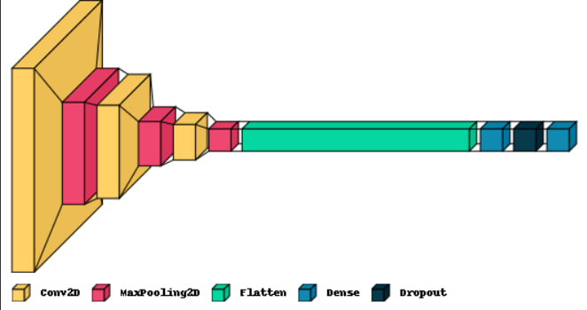
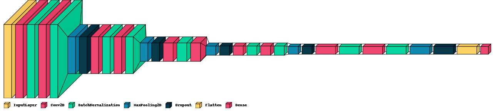
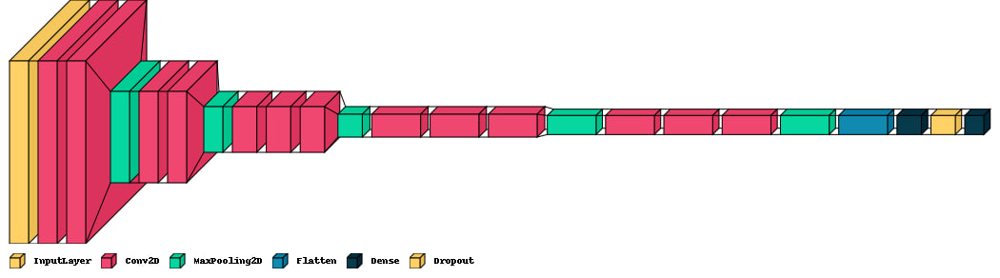

# Emotion Detection using Deep Learning Models + Real-Time

[](EmotionDetection.ipynb)


This repository contains the code for an Emotion Detection project using deep learning models and real-time processing. The project is implemented in Python using the TensorFlow framework and focuses on detecting human emotions from images and real-time video streams.

---

## Table of Contents

- [Introduction](#introduction)
- [Models](#models)
  - [Model 1 - Simple CNN](#model-1---simple-cnn)
  - [Model 2 - Complex CNN](#model-2---complex-cnn)
  - [Model 3 - VGG16 with Transfer Learning](#model-3---vgg16-with-transfer-learning)
- [Data Generator](#data-generator)
- [Dataset](#dataset)
- [Real-Time Emotion Detection](#real-time-emotion-detection)

---

## Introduction

The goal of this project is to build an emotion detection system that can recognize and classify human emotions from images and real-time video streams. The project is implemented using deep learning models and the TensorFlow framework, making use of three different models to achieve accurate emotion recognition.

---

## Models

In this project, three different deep learning models were utilized for emotion detection.


### Model 1 - Simple CNN

The first model is a simple Convolutional Neural Network (CNN) designed to detect emotions from input images. This model serves as a baseline for the subsequent, more complex models.




### Model 2 - Complex CNN

The second model is a more complex CNN architecture, which aims to improve emotion detection accuracy compared to the simple CNN model.




### Model 3 - VGG16 with Transfer Learning

The third model utilizes the VGG16 architecture with transfer learning. The VGG16 model, pre-trained on a large dataset, is employed as a feature extractor. The last layer of the VGG16 model is updated and fine-tuned to suit the emotion detection task.



---

## Data Generator

To prevent overfitting and improve the accuracy of all three models, a data generator is employed. The data generator feeds data to the models in batches, allowing for efficient memory usage during training.

---

## Dataset

The emotion detection models were trained and evaluated using the [FER - Faces Emotion Recognition](https://www.kaggle.com/datasets/ananthu017/emotion-detection-fer) dataset available on Kaggle. The dataset consists of facial images categorized into various emotions, making it suitable for training emotion recognition models.

---

## Real-Time Emotion Detection

In the last section of the project, real-time emotion detection is implemented using OpenCV. The models trained previously are deployed to analyze emotions in live video streams, making the project applicable to real-world scenarios.

---

## How to Use

1. Install the required dependencies.

```bash
pip install tensorflow opencv-python numpy matplotlib visualkeras
```

2. Open EmotionDetection.ipynb with jupyter-lab or jupyter notebook.

* or open notebook in colab (real-time does not work in colab).

3. Enjoy your real-time emotion detection experience!

## Contributions

Contributions to the project are welcome! If you find any issues or have suggestions for improvements, feel free to open an issue or create a pull request.

---
